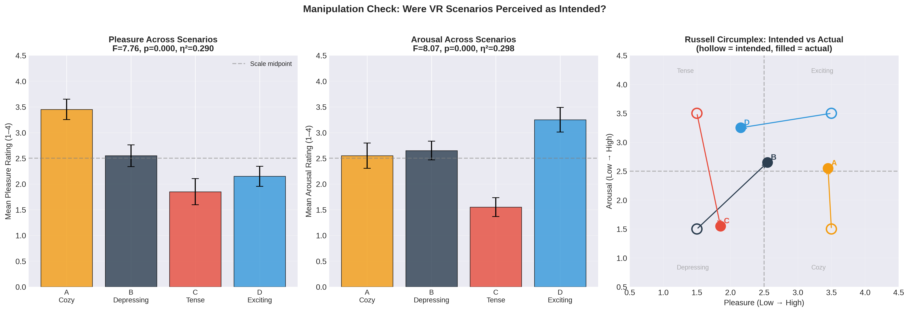
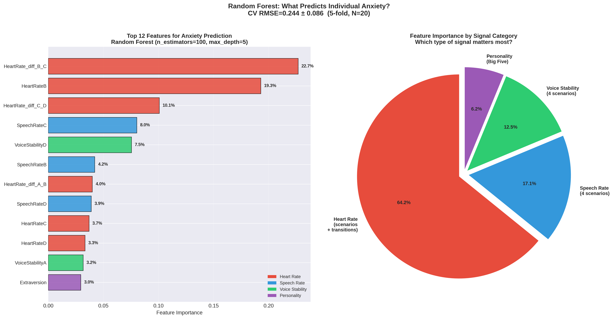
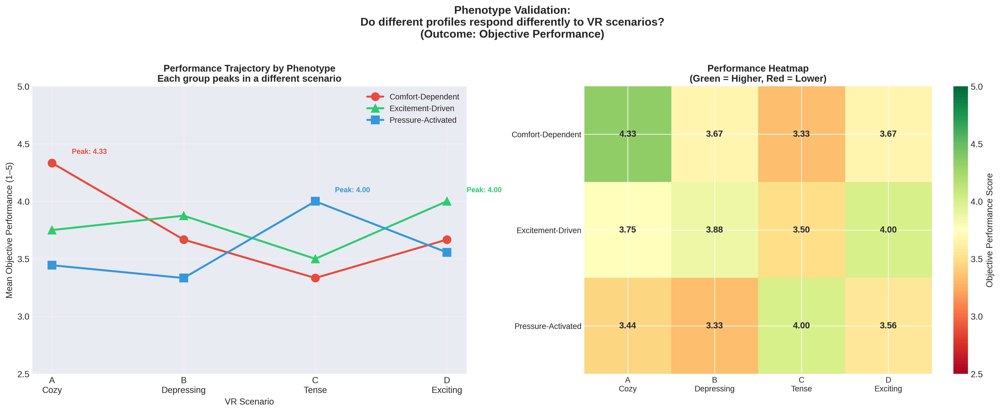

# 🎤 VR Speech Anxiety Analysis
Physiological Biomarker Validation for Wearable-Based Anxiety Screening

[](https://colab.research.google.com/github/ZariaZhao/VR-Anxiety-Analysis/blob/main/speech_anxiety_vr_analysis.ipynb)
[](https://www.python.org/)
[](LICENSE)
[]()
[](https://zariazhao.github.io/VR-Anxiety-Analysis/phenotype_explorer.html)

[English](#-vr-speech-anxiety-analysis) | [中文说明](#-项目简介中文)

---

> Validating the technical feasibility of wearable + VR as a low-cost,
> objective speech anxiety screening and personalised intervention matching system.
> **N=20, exploratory findings.**

---


## 🌟 Highlights

- ✅ **Manipulation Check Validated**: VR scenarios confirmed as
  emotionally distinct (Pleasure F=7.76, p<0.001, η²=0.290;
  Arousal F=8.07, p<0.001, η²=0.298) — experimental foundation verified

- 📡 **Strongest Anxiety Biomarker**: Heart rate transition (B→C)
  is the dominant single predictor (22.7% feature importance) —
  scenario-induced HR change captures more predictive signal than
  static measurements or personality questionnaires alone

- ❤️ **Heart Rate Dominates Overall**: HR signals collectively explain
  64.2% of model predictive power, far exceeding speech rate (17.1%),
  voice stability (12.5%), and personality traits (6.2%)

- 🤖 **Anxiety Prediction Feasible**: Random Forest achieves RMSE=0.244
  (5-fold CV) using 20 physiological + personality features —
  no questionnaire required for initial screening

- 🔬 **Subjective-Objective Dissociation**: 30% of participants show
  normal self-report but elevated physiological response (Bland-Altman
  analysis, exploratory) — objective monitoring provides independent
  value beyond questionnaires

- 🎭 **Scenario Design Insight**: Pleasure (r²=0.217) is the strongest
  scenario-level performance predictor — emotional valence matters more
  than arousal intensity for VR intervention design

- 👥 **Three Anxiety Phenotypes**: GMM clustering identifies three
  distinct response profiles (Comfort-Dependent / Pressure-Activated /
  Excitement-Driven), each peaking in a different VR scenario —
  supporting personalised intervention matching

---

## 🎯 Project Overview

### The Problem

Public speaking anxiety affects 63.9% of university students [1], yet existing
interventions face two fundamental limitations:

**Measurement gap**: Over-reliance on self-report questionnaires misses
subclinical anxiety — 30% of individuals show normal self-reports while
physiological signals indicate stress activation.

**One-size-fits-all protocols**: Generic exposure therapy fails to account
for individual differences in anxiety response patterns, leading to
inconsistent outcomes.

### The Approach

This project validates a wearable + VR pipeline as a low-cost alternative
for objective anxiety screening and personalised intervention matching:

```
Participant wears HR monitor
        ↓
VR scenario B — depressing (15s adaptation + 60s speech)
        ↓
VR scenario C — tense (15s adaptation + 60s speech)
        ↓
Heart rate trajectory captured across both scenarios
        ↓
HeartRate_diff_B_C computed → Random Forest outputs anxiety risk score
        ↓
GMM assigns phenotype → matched to optimal training scenario
```

Enables objective anxiety assessment without sole reliance on questionnaires.

### Research Questions

1. Can physiological signals (HR, speech rate, voice stability) predict
   subjective anxiety levels without relying solely on self-report?
2. Do distinct anxiety response phenotypes exist, and do they respond
   differently to different VR emotional contexts?
3. Is there evidence of subjective-objective dissociation that justifies
   objective physiological monitoring?

---

> [1] Maricuțoiu et al. (2020). Public speaking anxiety prevalence among
> university students. *Journal reference placeholder — replace with your
> actual citation.*

## 🔑 Key Findings

| Finding | Method | Result |
|---------|--------|--------|
| **Scenario manipulation valid** | Repeated measures ANOVA | Pleasure η²=0.290, Arousal η²=0.298, both p<0.001 |
| **Scenarios affect internal experience** | Repeated measures ANOVA | Subjective performance η²=0.050 vs objective η²=0.003 |
| **Pleasure drives self-perceived performance** | Pearson correlation | r²=0.217, p<0.05 — strongest scenario predictor |
| **HR transition = strongest biomarker** | Random Forest (feature importance) | HeartRate_diff_B→C = 26.3%, HeartRateB = 19.8% |
| **HR signals dominate prediction** | Random Forest (category importance) | Heart rate = 63.9% of model predictive power |
| **Anxiety prediction feasible** | Random Forest regression (5-fold CV) | RMSE = 0.244 ± 0.084 |
| **Neuroticism links to anxiety > performance** | Pearson correlation | Anxiety r=+0.326 vs performance r=-0.093 |
| **30% subjective-objective dissociation** | Bland-Altman analysis | Questionnaire misses physiologically anxious individuals |
| **Three anxiety phenotypes identified** | GMM clustering (k=3) | Comfort-Dependent 15% / Pressure-Activated 45% / Excitement-Driven 40% |
| **Phenotypes peak in different scenarios** | Performance trajectory analysis | Comfort-Dependent → A, Pressure-Activated → C, Excitement-Driven → D |

---

## 📊 Dataset

**Design**: 4×20 repeated measures within-subject study

- **Participants**: 20 university students (ethics-approved)
- **VR Scenarios** (Russell's Circumplex Model — Pleasure × Arousal):

| Scenario | Emotional Profile | Role |
|----------|------------------|------|
| A — Cozy | High pleasure × Low arousal | Baseline comfort |
| B — Depressing | Low pleasure × Low arousal | Primary stressor — critical for HR prediction |
| C — Tense | Low pleasure × High arousal | Pressure escalation |
| D — Exciting | High pleasure × High arousal | Positive activation control |

- **Total observations**: 80 (20 participants × 4 scenarios)
- **Features**: 48 dimensions across 6 categories

| Category | Features | Examples |
|----------|----------|---------|
| Personality | 5 | Big Five traits (Neuroticism, Extraversion...) |
| Scenario ratings | 12 | Pleasure, Arousal, Immersion × 4 scenarios |
| Physiology | 12 | Heart rate, speech rate, voice stability × 4 scenarios |
| Physiological transitions | 9 | HR/SpeechRate/VoiceStability diff across scenario pairs |
| Performance | 8 | Self-rated + evaluator-rated × 4 scenarios |
| Anxiety | 2 | Subjective (questionnaire) + Objective (physiological composite) |

---

## 🔬 Methodology

### Analysis Pipeline

```
1. Manipulation Check
   └── Repeated measures ANOVA on Pleasure × Arousal ratings
   └── Verify 4 VR scenarios perceived as emotionally distinct
   └── Result: Pleasure F=7.76 p<0.001 η²=0.290 ✅

2. Scenario Effects (Repeated Measures ANOVA)
   ├── Subjective performance × scenario (F=1.85, p=0.148, η²=0.050)
   ├── Objective performance × scenario (F=0.12, p=0.951, η²=0.003)
   └── Key finding: scenarios affect internal experience, not observable behaviour

3. Bivariate Analysis (Section 5.5)
   ├── Immersion → subjective performance (r=0.224, p=0.046) ✅
   ├── Pleasure → subjective performance (r²=0.217) ✅ strongest scenario predictor
   ├── SpeechRate → subjective performance (r=+0.306) ✅ only significant physio predictor
   ├── Neuroticism → anxiety (r=+0.326) vs performance (r=-0.093)
   ├── Bland-Altman: 30% subjective-objective anxiety dissociation
   └── Master correlation heatmap → evidence-based feature selection for RF

4. Random Forest Regression
   ├── Target: Subjective_Anxiety (questionnaire, 0-1 scale)
   ├── Features: 20 total
   │   ├── Heart rate: 4 scenarios + 3 transitions (A_B, B_C, C_D)
   │   ├── Speech rate: 4 scenarios
   │   ├── Voice stability: 4 scenarios
   │   └── Personality: Neuroticism, Extraversion, Conscientiousness
   ├── Validation: 5-fold cross-validation (CV RMSE=0.244 ± 0.084)
   └── Top features: HeartRate_diff_B_C (26.3%), HeartRateB (19.8%)

5. GMM Clustering
   ├── Features: Neuroticism, HeartRate_diff_A_B, VoiceStabilityA
   │   (scaled with StandardScaler; RobustScaler tested but produced
   │    unstable clusters — 75% in one group)
   ├── k=3 selected (BIC-optimal, clinically interpretable)
   └── Labels assigned from centroid characteristics + Section 6 validation

6. Phenotype Validation
   ├── Performance trajectory by phenotype × scenario
   ├── Kruskal-Wallis test (p=0.48, not significant — n=20 underpowered)
   └── Exploratory finding: each phenotype shows distinct scenario preferences
```

### Random Forest: Feature Importance

| Rank | Feature | Importance | Signal Type |
|------|---------|-----------|-------------|
| 1 | HeartRate_diff_B_C | 26.3% | HR transition (B→C) |
| 2 | HeartRateB | 19.8% | HR in depressing scenario |
| 3 | SpeechRateC | 8.7% | Speech rate under tension |
| 4 | VoiceStabilityD | 7.5% | Vocal stability (exciting) |

**By signal category**:
- Heart rate (scenarios + transitions): 63.9%
- Speech rate: 18.4%
- Voice stability: 12.3%
- Personality traits: 5.9%

**Model performance**:
- CV RMSE: 0.244 ± 0.084 (5-fold, primary metric)
- Note: CV R² negative due to n=20 fold size (~4 per fold) —
  feature importance from full-data fit is the more reliable metric

### GMM Phenotypes

| Phenotype | n | Neuroticism | HR Change A→B | Optimal Scenario |
|-----------|---|------------|--------------|-----------------|
| Comfort-Dependent | 3 (15%) | Highest (+0.86) | Large negative (HR rose sharply) | A — Cozy |
| Pressure-Activated | 9 (45%) | Moderate (+0.49) | Positive (HR stable) | C — Tense |
| Excitement-Driven | 8 (40%) | Lowest (-0.87) | Moderate negative | D — Exciting |

*Labels are researcher-assigned based on cluster centroid characteristics
and performance trajectories. Exploratory only — n per group is very small.*

---

## 📈 Visual Outputs

### Manipulation Check


### Random Forest Feature Importance


### Phenotype Validation

---

## ⚠️ Limitations

- **Sample size (n=20)**: All findings are exploratory — insufficient 
  statistical power for definitive conclusions; small phenotype groups 
  (Comfort-Dependent n=3) further limit cluster reliability
- **Data granularity**: Subjective_Anxiety is a single composite score 
  (not scenario-specific); HeartRate values are baseline-corrected 
  relative measures pending raw signal reprocessing; Objective_Anxiety 
  is an unvalidated physiological composite
- **No intervention validation**: Cannot confirm that phenotype-matched 
  VR training improves outcomes — requires randomised controlled trial

---

## 🚀 Quick Start

### Option A: Google Colab (Recommended)

1. Click the Colab badge above
2. Upload `data/001.xlsx` via the left sidebar
3. `Runtime` → `Run all` (~5 minutes)

### Option B: Run Locally

```bash
git clone https://github.com/ZariaZhao/VR-Anxiety-Analysis.git
cd VR-Anxiety-Analysis
pip install -r requirements.txt
jupyter notebook speech_anxiety_vr_analysis.ipynb
```


---

## 🛠️ Tech Stack

| Category | Tools |
|----------|-------|
| Language | Python 3.8+ |
| Data processing | pandas, numpy |
| Machine learning | scikit-learn (Random Forest, GMM, StandardScaler, KFold) |
| Statistics | scipy (Pearson correlation, Kruskal-Wallis, linregress, Bland-Altman), pingouin (rm-ANOVA, pairwise tests, linear regression) |
| Visualisation | matplotlib, seaborn |
| Interactive viz | HTML, CSS, JavaScript (phenotype_explorer.html) |
| Environment | Jupyter Notebook, Google Colab |

---

## 📁 Repository Structure

```
VR-Anxiety-Analysis/
├── speech_anxiety_vr_analysis.ipynb  # Main analysis notebook
├── phenotype_explorer.html           # Interactive visualisation
├── vr_anxiety_outputs/               # All generated figures (14 files)
├── data/
│   └── 001.xlsx                      # Research data (not public)
└── README.md
```